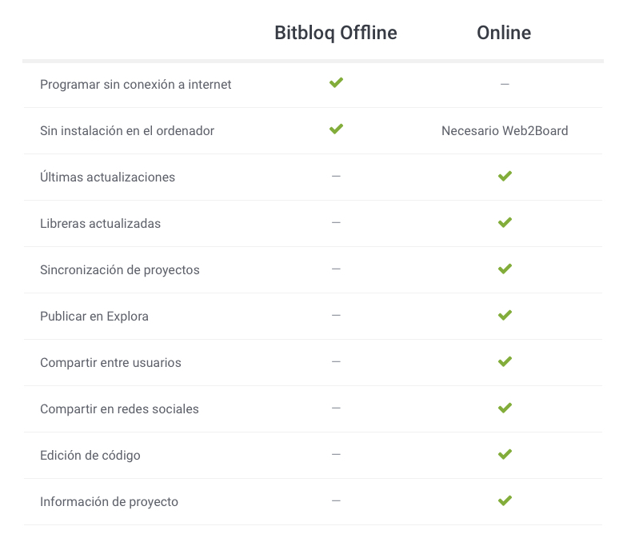

# Bitbloq Offline 

[es_ES]

Esta es la versión offline oficial del proyecto Bitbloq, una [herramienta de programación visual](https://es.wikipedia.org/wiki/Programaci%C3%B3n_visual) de [Arduino](https://www.arduino.cc/).

Puedes utilizar la versión online [aquí](http://bitbloq.bq.com).

En la versión actual soportamos las siguientes placas:

 - Arduino UNO
 - Freaduino UNO
 - BQ ZUM

Y los siguientes robots:

 - ZOWI

¿Utilizas otra placa o robot y quieres que la añadamos en Bitbloq? Escríbenos a soporte.bitbloq@bq.com e intentaremos hablar con el fabricante para que nos permita introducirlo en Bitbloq. 
Por supuesto es un proyecto Open Source y también aceptamos contribuciones de cualquier persona siempre que sean correctas.

Actualmente Bitbloq offline funciona en las siguientes plataformas:

 - Linux (Ubuntu 12.04 y superior, Fedora 21, Debian 8)
 - Mac OS X 10.9 o superior
 - Windows 7 y posterior, ambos 32 y 64 (la versión ARM de Windows no está soportada por ahora).

Puedes encontrar los instaladores de la aplicación aquí:

 - [Linux](https://github.com/bq/bitbloq-offline/releases/download/v1.0.1/linux.zip)
 - [Mac](https://github.com/bq/bitbloq-offline/releases/download/v1.0.1/mac.zip)
 - [Windows](https://github.com/bq/bitbloq-offline/releases/download/v1.0.1/windows.zip)


Notas:
 
 - Es una aplicación portable, no requiere instalación ni permisos de administrador para ejecutarse, pero tu placa es posible que requiera drivers, hemos añadido algunos en la carpeta drivers de la aplicación. ¡ Acuérdate de instalarlos !
 
 - Acuérdate de descomprimir el fichero que te descargas en una carpeta en la que luego el usuario que lo utilice tenga permisos, por ejemplo, en windows no la descomprimas directamente en "c:", o en la carpeta de "c:/Archivos de programa", ejemplos válidos son la carpeta "Documentos" del usuario o en el escritorio.
 
 - ¿No te detecta la placa y está conectada el ordenador? Revisa [este documento](docs/motherboard_troubleshooting.pdf) y si sigues teniendo incidencias, no dudes en escríbirnos a soporte.bitbloq@bq.com.

Recuerda que al ser una aplicación offline, no tendrás todas las ventajas ni novedades de la web. Te recomendamos que la uses solo cuando no tienes conexión estable a internet.

 

# Bitbloq Offline

[en_GB]

This is the offline version of the Bitbloq project, a [visual programming tool](https://en.wikipedia.org/wiki/Visual_programming_language) for [Arduino](https://www.arduino.cc/).

You can visit the online version [here](http://bitbloq.bq.com)

The current version supports the following boards:

 - Arduino UNO
 - Freaduino UNO
 - BQ ZUM

And the following robots:

 - ZOWI

Do you have another board or robot? email us to support.bitbloq.en@bq.com, and we will try to talk with the manufacturer to allow us to introduce it on Bitbloq.
Bitbloq its an Open Source Project so we will accept contributions if this are correct.

In this platforms:

 - Linux (Ubuntu 12.04 and later, Fedora 21, Debian 8)
 - Mac OS X 10.9 or greater
 - Windows 7 and later, both 32 and 64 (ARM version os Windows is not suported for now).

You can find binaries here:

 - [Linux](https://github.com/bq/bitbloq-offline/releases/download/v1.0.0/linux.zip)
 - [Mac](https://github.com/bq/bitbloq-offline/releases/download/v1.0.0/mac.zip)
 - [Windows](https://github.com/bq/bitbloq-offline/releases/download/v1.0.0/windows.zip)

## Getting Started ##

Clone the repo:

    git clone https://github.com/bq/bitbloq-offline.git

Get into the directory:

       cd bitbloq-offline/

Install npm and Bower components:

    npm install
    bower install
Launch the app:

    electron .


## Packaging ##
Just build for all Operating systems:

    grunt dist

Or depending on the operating system:


- Windows:

        grunt build:windows
- Linux:

        grunt build:linux
- Mac:

        grunt build:mac

This will generate a `/dist/{os}` folder with the app ready to be launched.


## App Structure ##
```
app
├── fonts // App fonts
├── images // App images
│   ├── boards // Images for boards
│   ├── components // Images for components
│   ├── icons // Icons for svgstore
│   └── robots // Images for robots
├── res // Common resources
│   ├── locales // Language translations
│   ├── menus // JSON files for generating menus
│   └── web2board // web2board nested app
├── scripts // Angular scripts
│   ├── controllers // Angular controllers
│   ├── directives // Angular directives
│   ├── factories // Angular factories
│   └── services // Angular services
├── styles // App styles
│   ├── components // Styles for components
│   ├── vendor // Vendor styles
│   └── views // Styles for views
└── views // All views
│   ├── components // Views for components
│   └── view.html // App normal view
└── main.js // Electron config
```


## Developing ##

You can set your own config in `main.js` file.  

Grunt tasks

    grunt svgstore // Generates an svg sprite from icons folder.
    grunt sass // Compiles scss files to a single main.css file.
    grunt watch // Watches yout changes and reloads the app.
